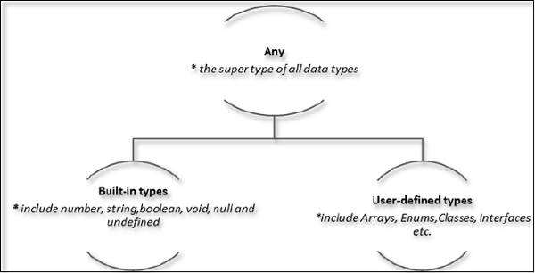
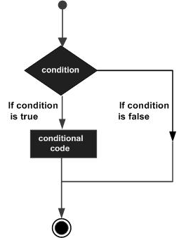
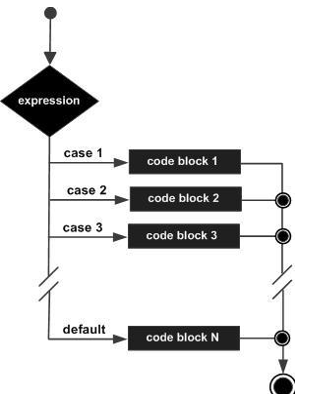
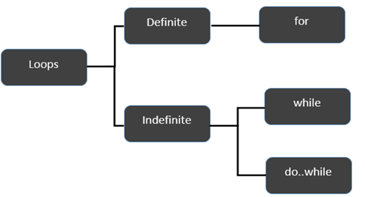
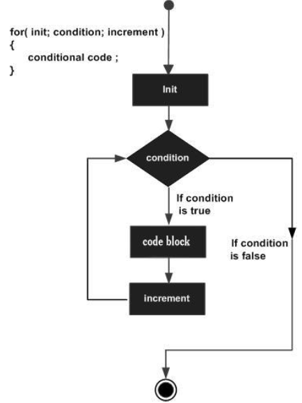
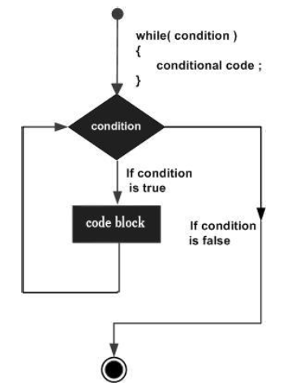
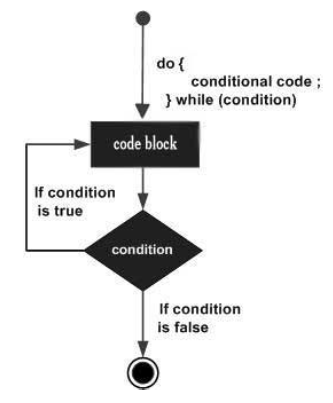

#TypeScript Handbook

##Contents:

1. [Variables](#variable)
2. [Data Types](#data-type)
3. [Operator](#operator)
4. [Decision Making](#decision)
5. [Loops](#loop)
6. [Functions](#function)
7. [Classes](#class)
8. [Objects](#object)
9. [Others](#other)

### Must remember:

- Javascript/Typescript is single thread
- Javascript/Typescript is interpreter language. It mean, Javascript/Typescript is not complie to machine code. It run by V8-engine
- Javascript/Typescript is full stack language

### 1. Declare variable {#variable}

- There are 2 type of variables
  - Value variables:
  - Refs variables:
- Naming:
  - alphabets, numeric digits
  - can not contain spaces and special characters but except "\_" and "$"
  - can not start with prefix is digit but can start with "\_"
- Syntax:

  ```
  variable_key_word variable_name [: type_annotation] = [variable_value];
  ```

  eg:
  Declare a mutable variables

  ```
  let varNotHaveDefaultValue; // will return undefined
  let strName = 'ThanhLD';
  let strCompanyName:string = 'VFA';
  let isWorking:boolean = true;
  let numWorkingYears:number = 3;
  ```

  Declare an immutable variables

  ```
  const strName = 'ThanhLD';
  const strCompanyName:string = 'VFA';
  const isWorking:boolean = true;
  const numWorkingYears:number = 3;
  ```

### 2. Data types {#data-type}



- The Any type: is the super type. Using when do not wanna check type of variable or not sure about variable's type.
- Built-in types: The type was provided by TypeScript
  | Data type | Keyword | Description | Example
  | ---------------| ----------- |----------- |----------- |
  | Number | number |Double precision 64-bit floating point values. It can be used to represent both, integers and fractions.tle | let numRecords:number = 2;<br>let pi:number = 3.14;
  | String | string |Represents a sequence of Unicode characters | let myName:string = 'Justin Le';
  | Boolean | boolean |Represents logical values, true and false | let isValid:boolean = true;
  | Void\* | void |Used on function return types to represent non-returning functions |
  | Null | null |Represents an intentional absence of an object value. | let varNull = null;
  | Undefined | undefined |Denotes value given to all uninitialized variables | let varUndefined;
- User-defined Types

  - Complex data type but powerful
  - The variables declare with User-defined Types is Refs variables
  - Tools to apply OOP and data structures

    ###### a. Array - [Refs](https://www.tutorialspoint.com/typescript/typescript_arrays.htm)

    - An array declaration allocates sequential memory blocks.
    - Data type of values maybe have same or not
    - Access array element by index start at 0 index
    - Syntax:
      ```
      let array_name[:datatype];        //declaration
      or
      let array_name[:datatype] = new Array([size_of_array]);
      array_name = [val1,val2,valn..];   //initialization
      let array_name[:data type] = [val1,val2…valn]; // declaration and initialization
      ```
    - Eg:

      ```
      let alphas:string[];
      alphas = ["1","2","3","4"];
      console.log(alphas[0]); // return 1
      ```

      ```
      let nums:number[] = [1,2,3,3];
      console.log(nums[0]); // return 1
      ```

      Declare empty array with size = 4

      ```
      var arr_names:number[] = new Array(4)
      ```

      iterate array

      ```
      let arrNum = [1, 2, 3, 4];

      for (let i = 0; i < arrNum.length; i++) {
          console.log(arrNum[i]);
      }
      ```

      ```
      let arrNum:any = [1, 2, 3, 4];
      for(let index in arrNum) {
          console.log('value is:', arrNum[index]);
      }
      ```

      ```
      let num = [7, 8, 9];
      num.forEach(function (value) {
          console.log(value);
      });
      ```

    ###### b. Tuples - [Refs](https://www.tutorialspoint.com/typescript/typescript_tuples.htm)

    At times, there might be a need to store a collection of values of varied types. Arrays will not serve this purpose. TypeScript gives us a data type called tuple that helps to achieve such a purpose.

    ###### c. Interfaces - [Refs](https://www.tutorialspoint.com/typescript/typescript_interfaces.htm)

    - An interface is a syntactical contract that an entity should confirm to
    - Providing a standard structure
    - Interfaces contain only the declaration of the members.
    - May contain string, number, function...
    - Syntax:
      ```
      interface interface_name {
          propertie_name : type,
          ....
      }
      ```
    - Eg:

      ```
      interface IPerson {
          firstName:string,
          lastName:string,
          sayHi: ()=>string
      }

      let customer:IPerson = {
          firstName:"Tom",
          lastName:"Hanks",
          sayHi: ():string =>{return "Hi there"}
      }

      console.log("Customer Object ")
      console.log(customer.firstName)
      console.log(customer.lastName)
      console.log(customer.sayHi())
      ```

    ###### d. Enum - [Refs](https://www.typescriptlang.org/docs/handbook/enums.html)

    - Using to define a set of named constants.
    - Immutable
    - There are Numeric enums, String enums, Heterogeneous(combine Numeric and String) enums
    - Syntax:
      Numeric enums
      ```
      enum Enum_name {
          key_name_1 = 1,
          Key_name_2 = 2,
          key_name_3, // value of key_name_3 is 3
          ...
      }
      ```
      String enums
      ```
      enum Enum_name {
          key_name_1 = 'Hello',
          Key_name_2 = 'Bello,
          ...
      }
      ```
      Heterogeneous enums
      ```
      enum Enum_name {
          key_name_1 = 1,
          Key_name_2 = 'Hello,
          ...
      }
      ```
      Access enums's element
      ```
      enum Enum_name {
          key_name_1 = 1,
          Key_name_2 = 'Hello,
          ...
      }
      console.log(Enum_name.key_name_1);
      console.log(Enum_name['key_name_1']);
      ```

    ###### e. Class - [Section 7](#class)

    ###### f. Object - [Section 8](#object)

### 3. Operator {#operator}

- Arithmetic Operators
  | Operator | Description | Example |
  | ---------------| ----------- |----------- |
  | + (Addition) | returns the sum of the operands |a + b is 15 |
  | - (Subtraction) | returns the difference of the values |a - b is 5 |
  | _ (Multiplication) | returns the product of the values |a _ b is 50 |
  | / (Division) | performs division operation and returns the quotient |a / b is 2 |
  | % (Modulus) | performs division operation and returns the remainder |a % b is 0 |
  | ++ (Increment)(_) | Increments the value of the variable by one |a++ is 11 |
  | -- (Decrement)(_) | Decrements the value of the variable by one |a-- is 9 |
- Relational Operators
  | Operator | Description | Example |
  | ---------------| ----------- |----------- |
  | > | Greater than | |
  | < | Lesser than | |
  | >= | Greater than or equal to | |
  | <= | Lesser than or equal to | |
  | == | Equality | |
  | != | Not equal | |
- Logical Operators
  | Operator | Description | Example |
  | ---------------| ----------- |----------- |
  | && (And) | The operator returns true only if all the expressions specified return true | |
  | ! (NOT) | The operator returns the inverse of the expression’s result. For E.g.: !(>5) returns false | |
  | &#124;&#124; (OR) | The operator returns true if at least one of the expressions specified return true | |
- Assignment Operators
  | Operator | Description | Example |
  | ---------------| ----------- |----------- |
  | = (Simple Assignment) | Assigns values from the right side operand to the left side operand | |
  | += (Add and Assignment) | It adds the right operand to the left operand and assigns the result to the left operand. | |
  | -= (Subtract and Assignment) | It subtracts the right operand from the left operand and assigns the result to the left operand. | |
  | \*= (Multiply and Assignment) | It multiplies the right operand with the left operand and assigns the result to the left operand. | |
  | /= (Divide and Assignment) | It divides the left operand with the right operand and assigns the result to the left operand. | |

### 4. Decision Making {#decicion}

- There are 2 type of Decision Making
- Using to executed one or more statements by one or more conditions
  ###### a. If ... else
  
  - Syntax:
    ```
    if(boolean_expression) {
        // statement(s) will execute if the boolean expression is true
        } else {
        // statement(s) will execute if the boolean expression is false
    }
    ```
  - Eg:
    ```
    let numYears:number = 12;
    if (num % 2 == 0) {
        console.log("Even");
    } else {
        console.log("Odd");
    }
    ```
  ###### b. switch
  
  - Syntax:
    ```
    switch(variable_expression) {
        case constant_expr1: {
            //statements;
            break;
        }
        case constant_expr2: {
            //statements;
            break;
        }
        default: {
            //statements;
            break;
        }
    }
    ```
  - Eg:
    ```
    let grade:string = "A";
    switch(grade) {
        case "A": {
            console.log("Excellent");
            break;
        }
        case "B": {
            console.log("Good");
            break;
        }
        case "C": {
            console.log("Fair");
            break;
        }
        case "D": {
            console.log("Poor");
            break;
        }
        default: {
            console.log("Invalid choice");
            break;
        }
    }
    ```

### 5. Loops {#loop}



###### a. for loop



- General:

  ```
      for (initial_count_value; [termination-condition]; [step]) {
          //statements
      }
  ```

  Eg:

  ```
     for(let i = 0 ;i <= 10; i++) {
         console.log('value of i:', i);
     }
  ```

- for in loop:
  ```
  for (let val in list) {
       //statements
  }
  ```
  Eg:
  ```
  let n:any = [1, 2, 3, 4];
  for(let item in n) {
      console.log('value is:', item);
  }
  ```

###### b. while loop



- Syntax:

  ```
  while(condition) {
      // statements if the condition is true
  }
  ```

  - Eg:

  ```
  let num:number = 5;
  let factorial:number = 1;

  while(num >=1) {
    factorial = factorial * num;
     num--;
  }
  console.log("The factorial  is "+factorial);
  ```

###### c. do...while loop



- Syntax:
  ```
  do {
      //statements
  } while(condition)
  ```
- Eg:
  ```
  let n:number = 10;
  do {
      console.log(n);
      n--;
  } while(n >= 0);
  ```

### 6. Functions {#function}

- Using for group codes to do something have same behavior
- Split codes or modularization
- There are 2 types of funtion: return value and no return

  ###### a. General funtion

  - Contain a context at declare moment
  - Syntax:
    ```
        function function_name (param1[:type], param2[:type], param3[:type])[:type] {
            // statement here
        }
    ```
  - Eg:
    No return value
    ```
        function disp_details(id:number,name:string,mail_id?:string) {
            if(mail_id!=undefined) {
                console.log("Email Id",mail_id);
            }
        }
        disp_details(123,"John");
        disp_details(111,"mary","mary@xyz.com");
    ```
    Return value
    ```
    function squareNumber(num:number):number {
        let powValue = number * number;
        return powValue;
    }
    console.log('square of 2 is:', squareNumber(2));
    ```

  ###### a. Arrow/lambda funtion

  - Using when wanna bind context in runtime
  - Syntax:

    ```
    ( [param1, parma2,…param n] )=>statement;

    // or

    ( [param1, parma2,…param n] )=> {

        //code block
    }
    ```

  - Eg:

    ```
    let foo = (x:number)=>10 + x
    console.log(foo(100))      //outputs 110

    // or

    let foo = (x:number)=> {
        x = 10 + x;
        console.log(x);
    }
    foo(100)
    ```

### 7. Classes - [Refs](https://www.typescriptlang.org/docs/handbook/classes.html) {#class}

- It is an upgrade of function
- Using to implement OOP
- It is a User-defined Data Types
- Syntax:

  ```
  class ClassName {
      // private properties - access only inside class
      private PROPERTIES_NAME[:type] [= init_value];
      #PROPERTIES_NAME[:type] [= init_value]; // using for Javascript
      // protected properties - access inside class and children class
      PROPERTIES_NAME[:type] [= init_value];
      // public properties - access outside class, must be new instance of class
      public PROPERTIES_NAME[:type] [= init_value];
      // static properties - access outside class without new instance of class

      // constructor
      // if not declare - default constructor will be apply
      constructor(initValue[:type]) {
          // using when wanna Inheritance all properties os parent
          super([parameters of parent])
          this.FIELD_NAME = initValue
      }

      [access_modifier] get getFunctionName() {
          // any statement here
          return this.[PROPERTIES_NAME];
      }

      [access_modifier] set setFunctionName(newValue:type) {
          // any statement here
          this.[PROPERTIES_NAME] = newValue;
      }

      // private function - just access inside class
      private methodName([params [:type] [= init_value]])[:type] {
          // statement here
      }

      // protected function - access inside and children class
      methodName([params [:type] [= init_value]])[:type] {
          // statement here
      }

      // public function - access outside class within new instance
      public methodName([params [:type] [= init_value]])[:type] {
          // statement here
      }

      // static function - access outside class without new instance
      // static method can not access class's properties
      // just access static properties
      static methodName([params [:type] [= init_value]])[:type] {
          // this statement will throw error
          console.log(this.[non-static-properties])
          // statement here
      }
  }
  ```

- Eg:

  ```
  class Person {
      private _age: number;
      private _firstName: string;
      private _lastName: string;
      protected protectedField: boolean = false;
      public propPublic1:string = 'hello' ;
      propPublic2:string = 'bello';
      static staticName:string ='static';

      constructor(age:number, firstName:string, lastName:string){
          this._age = age;
          this._firstName = firstName;
          this._lastName = lastName;
      }

      public get age() {
          return this._age;
      }

      public set age(theAge: number) {
          if (theAge <= 0 || theAge >= 200) {
              throw new Error('The age is invalid');
          }
          this._age = theAge;
      }

      public getFullNamepublic(): string {
          return `${this._firstName} ${this._lastName}`;
      }

      protected getFullNameprotected(): string {
          return `${this._firstName} ${this._lastName}`;
      }
      private getFullNameprivate(): string {
          return `${this._firstName} ${this._lastName}`;
      }

      static getFullNamestatic(): string {
          //console.log(this._firstName) - Property '_firstName' does not exist on type 'typeof Person'.
          return '';
      }
  }
  // Inheritance
  class Thanh extends Person{
      constructor(age:number, firstName:string, lastName:string){
          super(age, firstName,lastName);
      }
      testAccessProperties(){
          console.log(this.protectedField)
      }
  }
  // new instance
  const a = new Person(10,'thanh','le');
  console.log(a.getFullNamepublic)
  console.log(Person.staticName)
  ```

### 8. Objects - [Refs](https://developer.mozilla.org/en-US/docs/Web/JavaScript/Reference/Global_Objects/Object) {#object}

- Parent of all User's Defined Data Types
- An object is an instance which contains set of key value pairs.
- Syntax:
  ```
  let newObj = {
      propertie_name_1: 'hello',
      propertie_name_2: 2,
      propertie_name_3: [1, 2, 3],
      propertie_name_4: () => {},
      propertie_name_5: { sub_properties_name: 'helloe' }
  }
  ```
- Eg:

  ```
  let person = {
      firstName:"Tom",
      lastName:"Hanks",
      sayHello:function() {  }  //Type template
  }
  person.sayHello = function() {
  console.log("hello "+person.firstName);
  }
  person.sayHello();
  console.log(person.firstName);
  ```

  ```
  for(let item in person) {
      console.log(item)
  }
  ```

### 9. Others {#other}

###### Export:

Export variables, objects, values, classes.... to another using
Syntax
```
export [default] [type] export_object_name[:data_type] [= value];
```
Eg:
```
export class Person {}
export const PI = 3.14;
export function squareNumber() {}
export let getName = () => 'Hello'
const defaultEnums = {};
export default defaultEnums;
```

###### Import:
Syntax:
```
Import object_name from path_to_object;
```
Eg:
```
import Person from path_of_object;

const GaoXanh = new Person();
```

###### Console
Syntax:
```
console.log(value1 [,value2,....]);
console.error(error1 [, error2, error3,...]);
console.debug(obj1 [, obj2, ..., objN]);
console.info(obj1 [, obj2, ..., objN]);
```

###### setTimeout:
Delay statements after amount miliseconds after was called
Syntax:
```
setTimeout(function() {
    //statement
}, milliseconds[, param1, param2, ...])
or
setTimeout(() => {
    // statements
}, milliseconds[, param1, param2, ...]);
```
Eg:
```
setTimeout(function(){ alert("Hello"); }, 3000);
or
setTimeout(() => alert("Hello"), 3000);
```

###### setInterval:
Loop statements even amount miliseconds after was called
Syntax:
```
setInterval(function(){
    // statement
}, milliseconds[, param1, param2, ...]);
or
setInterval(() => {
    // statements
}, milliseconds[, param1, param2, ...]);
```

```
setInterval(function(){ alert("Hello"); }, 3000);
or
setInterval(() => alert("Hello"), 3000);
```

###### Promise - [Refs](https://developer.mozilla.org/en-US/docs/Web/JavaScript/Reference/Global_Objects/Promise):
Using for asynchronous jobs: API calling, multi task...
Prefer to use with multi task at the same time
Syntax:
```
const promise = new Promise((resolve, reject) => {
    // if success
    resolve([values]);
    // if failed
    reject[value]
});

promise
    .then(([result]) => { // do something when excuted completed})
    .catch((error) => { // do something when failed})
    .finally((final) => { // do something when final});

Promise.all([promise1, promise2, promise3]).then((values) => {
    // do something here when all promise return
});
```

Eg:

```
const promiseA = new Promise( (resolutionFunc,rejectionFunc) => {
    resolutionFunc(777);
});
// At this point, "promiseA" is already settled.
promiseA.then( (val) => console.log("asynchronous logging has val:",val) );
console.log("immediate logging");

// produces output in this order:
// immediate logging
// asynchronous logging has val: 777
```

```
const promise1 = Promise.resolve(3);
const promise2 = 42;
const promise3 = new Promise((resolve, reject) => {
    setTimeout(resolve, 100, 'foo');
});

Promise.all([promise1, promise2, promise3]).then((values) => {
    console.log(values);
});
// expected output: Array [3, 42, "foo"]
```

###### Async/Await - [Refs](https://developer.mozilla.org/en-US/docs/Web/JavaScript/Reference/Statements/async_function):
Using for asynchronous jobs: API calling, multi task...
Prefer to use with the result os prev task is input of next task
Syntax:
```
async function name([param[, param[, ...param]]]) {
    // statements
    // await calling async method
}

const result = await async_funtion_name([param[, param[, ...param]]]);
```

Eg:

```
function resolveAfter2Seconds() {
    return new Promise(resolve => {
        setTimeout(() => {
            resolve('resolved');
            }, 2000);
    });
}

async function asyncCall() {
    console.log('calling');
    const result = await resolveAfter2Seconds();
    console.log(result);
    // expected output: "resolved"
}

asyncCall();
```

###### Generator Function - [Refs](https://developer.mozilla.org/en-US/docs/Web/JavaScript/Reference/Statements/function*):

Generators are functions that can be exited and later re-entered. Their context (variable bindings) will be saved across re-entrances.

- Syntax

```
function* name([param[, param[, ... param]]]) {
   statements
}
```

<b>name</b>
&nbsp;&nbsp;The function name.
<b>param [Optional]</b>
&nbsp;&nbsp;The name of a formal parameter for the function.
<b>statements</b>
&nbsp;&nbsp;The statements comprising the body of the function.

- Eg:

```
function* idMaker() {
  var index = 0;
  while (true)
    yield index++;
}

var gen = idMaker();

console.log(gen.next().value); // 0
console.log(gen.next().value); // 1
console.log(gen.next().value); // 2
console.log(gen.next().value); // 3
// ...
```
